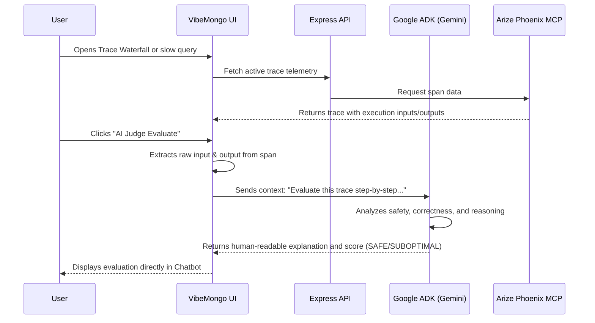

# Architecture Overview

## System Architecture

VibeMongo Admin is a full-stack MongoDB administration platform with an embedded AI agent layer powered by Google ADK.

```
┌─────────────────────────────────────────────────────────────────────────┐
│                          USER BROWSER                                   │
│                                                                         │
│   ┌───────────────────────────────────────────────────────────────┐    │
│   │               Vue 3 SPA (Vite + TypeScript)                   │    │
│   │                                                               │    │
│   │  ┌─────────────┐  ┌──────────────┐  ┌─────────────────────┐  │    │
│   │  │  Dashboard  │  │  Collections │  │  AgentChatSidebar   │  │    │
│   │  │  (DB List)  │  │  / Documents │  │  (AI Chat Panel)    │  │    │
│   │  └─────────────┘  └──────────────┘  └─────────────────────┘  │    │
│   │                                                               │    │
│   │  ┌──────────────────────────────────────────────────────────┐ │    │
│   │  │              Pinia Stores + Vue Router                   │ │    │
│   │  └──────────────────────────────────────────────────────────┘ │    │
│   └───────────────────────────────────────────────────────────────┘    │
│                    │ HTTP/REST (Axios)  ↕                               │
└────────────────────────────────────────────────────────────────────────┘
                     │
                     ▼
┌─────────────────────────────────────────────────────────────────────────┐
│                    EXPRESS API SERVER (Node.js / TypeScript)            │
│                          PORT 4000                                      │
│                                                                         │
│  ┌──────────────┐  ┌─────────────────┐  ┌────────────────────────────┐ │
│  │  REST Routes │  │  MongoService   │  │   AgentChatService         │ │
│  │  /api/*      │  │  (MongoDB       │  │   (Session management,     │ │
│  │              │  │   Driver)       │  │    history, streaming)     │ │
│  └──────────────┘  └────────┬────────┘  └────────────┬───────────────┘ │
│                             │                        │                  │
│  ┌──────────────────────────┤                        ▼                  │
│  │  ConnectionStore (SQLite)│           ┌────────────────────────────┐  │
│  │  Encrypted URI storage   │           │   Google ADK LlmAgent      │  │
│  └──────────────────────────┘           │   (InMemoryRunner)         │  │
│                                         │   Model: gemini-*          │  │
│                                         └────────────┬───────────────┘  │
│                                                      │                  │
│                                         ┌────────────▼───────────────┐  │
│                                         │   MongoDB MCP Tool Layer   │  │
│                                         │   (mongo.tools.ts)         │  │
│                                         │   FunctionTool wrappers    │  │
│                                         └────────────┬───────────────┘  │
└──────────────────────────────────────────────────────┼──────────────────┘
                                                       │
                           ┌─────────────────────────────┴──────────────────┐
                         │              EXTERNAL SERVICES                  │
                         │                                                 │
           ┌─────────────┴──────────────┐   ┌──────────────────────────┐  │
           │  mongodb-mcp-server        │   │  Google Vertex AI /      │  │
           │  (npx subprocess, stdio)   │   │  Gemini API              │  │
           │  MCP Protocol (JSON-RPC)   │   │  (LLM inference)         │  │
           └─────────────┬──────────────┘   └────────────┬─────────────┘  │
                         │                               │                │
           ┌─────────────▼──────────────┐   ┌────────────▼─────────────┐  │
           │   MongoDB                  │   │  Arize Phoenix MCP &     │  │
           │   (Atlas / self-hosted)    │   │  Cloud (Telemetry)       │  │
           └────────────────────────────┘   └──────────────────────────┘  │
                                        └─────────────────────────────────┘
```

---

## Component Breakdown

### Frontend (Client)

| Component | Technology | Role |
|-----------|-----------|------|
| Framework | Vue 3 + TypeScript | Reactive SPA |
| Build Tool | Vite | Fast HMR + production bundling |
| UI Library | Element Plus | Component library |
| Charts | ECharts, Chart.js | Data visualization |
| State | Pinia | Global stores |
| Routing | Vue Router 4 | Client-side navigation |
| HTTP | Axios | REST API communication |
| i18n | vue-i18n | Multi-language support |

### Backend (Server)

| Component | Technology | Role |
|-----------|-----------|------|
| Runtime | Node.js 20+ | JavaScript runtime |
| Framework | Express 4 | HTTP API server |
| Language | TypeScript | Type-safe backend |
| DB Driver | MongoDB Node.js Driver v6 | Direct database queries |
| Session Storage | NeDB | Server stats and monitoring |
| Connection Store | SQLite (sqlite3) | Encrypted connection profiles |
| File Upload | Multer | Backup file uploads |

### AI Agent Layer

| Component | Technology | Role |
|-----------|-----------|------|
| Agent SDK | `@google/adk` v1 | LLM Agent orchestration |
| LLM Model | Gemini (via Vertex AI) | Natural language understanding |
| Tool Transport | MCP stdio subprocess | Bridge to mongodb-mcp-server |
| MCP SDK | `@modelcontextprotocol/sdk` | JSON-RPC over stdio |
| Database Tools | `mongodb-mcp-server` (npx) | Official MongoDB MCP tools |
| Telemetry Tools| `@arizeai/phoenix-mcp` | Trace monitoring & DB-Guardian |
| Session | `InMemoryRunner` | Per-user conversation history |

---

## Data Flow Summary

### Standard DB Operation (No Agent)
```
Browser → REST /api/db/* → Express → MongoService → MongoDB Driver → MongoDB
```

### AI Agent Chat Operation
```
Browser → POST /api/agent/chat
  → Express → AgentChatService
    → Google ADK LlmAgent (Gemini model)
      → FunctionTool.execute()
        → callMcpTool() → mongodb-mcp-server (stdio subprocess, MCP JSON-RPC)
          → MongoDB Atlas / self-hosted
        → [Fallback] MongoService → MongoDB Driver → MongoDB
      ← Tool response
    ← Structured text response + JSON blocks
  ← JSON result (message, suggestions, navigation, chart, databases, collections)
← Rendered chat message + ECharts visual + clickable navigation
```

### DB-Guardian & AI Judge Evaluate Flow


## Server Bootstrapping & State Management

VibeMongo utilizes a modular bootstrapping pattern to start the Express application. The entrypoint `server/src/index.ts` sequentially invokes isolated bootstrap modules:

1. **`config.ts`**: Parses `nconf` and environment variables.
2. **`database.ts`**: Initializes the internal `@seald-io/nedb` engine for server stats/monitoring.
3. **`middlewares.ts`**: Mounts CORS, session management, and global error handlers.
4. **`routes.ts`**: Mounts the main `/api` router, OpenInference tracing, and the SPA static fallback.

### Global State & Dependency Injection

VibeMongo has eradicated the Express anti-pattern of using `req.app.locals` for mutable global state. 
- **Connection Manager**: Database connections are managed by a centralized, multi-tenant `MongoService`. It securely stores connection objects (`MongoClient` instances) in memory using a strongly-typed `Map<string, ConnectionObject>`.
- **Dependency Injection**: Route handlers (`databases.ts`, `collections.ts`, etc.) retrieve the correct active connection object by injecting `mongoService.getConnection(req.params.conn)` instead of accessing a global singleton.
- **Agent Context Sync**: For backwards compatibility with the AI agent layer, `MongoService` tracks an "active context" via `setActiveConnection()` during chat operations.

---

## Security Model

- **Connection strings** are encrypted at rest in SQLite using a 32-byte `ENCRYPTION_KEY`.
- **Session auth** is handled via `express-session` with a server-side secret.
- **CORS** is configured to allow the frontend origin only.
- **Agent guardrails** are enforced via the system prompt — destructive operations require explicit user confirmation.
- **MCP subprocess** inherits the encrypted connection string at runtime; the raw URI is never logged.
