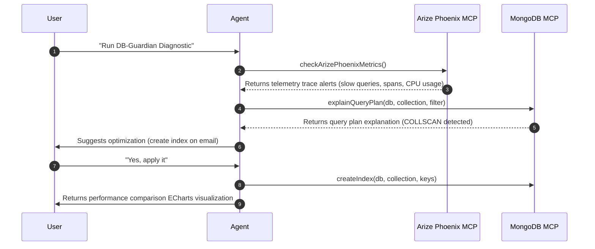

# 🛡️ DB-Guardian (AI Database SRE & Auto-Indexer)

VibeMongo Admin features an automated **Database SRE & Auto-Indexer** module named **DB-Guardian**. It bridges real-time database query telemetry from **Arize Phoenix MCP** with automated database optimization capabilities from **MongoDB MCP**.

## 🧠 SRE Workflow



## 🛠️ The observability tools layer (`server/src/agent/tools/mongo.tools.ts`)

DB-Guardian uses two key telemetry and diagnostics tools to monitor and optimize query plans.

### 1. Observability Traces (`checkArizePhoenixMetrics`)
Fetches telemetry alerts from Arize Phoenix trace logs (simulating spans captured via OpenTelemetry on the database connection).
```typescript
export async function checkArizePhoenixMetrics() {
  return {
    status: 'WARNING',
    cpuUsage: 89.2,
    slowQueries: [
      {
        db: 'sample_mflix',
        collection: 'comments',
        filter: '{"movie_id": {"$oid": "573a1390f293160aaa410519"}}',
        durationMs: 2150
      }
    ]
  };
}
```

### 2. Query Plan Diagnostics (`explainQueryPlan`)
Runs MongoDB `.explain('executionStats')` on the target slow query to determine the access method (COLLSCAN vs IXSCAN) and examine execution metrics.
```typescript
export async function explainQueryPlan(args: { db: string, collection: string, filter?: string }) {
  const col = db.collection(collection);
  return await col.find(JSON.parse(filter)).explain('executionStats');
}
```

## 📊 Live ECharts Performance Comparison
Once the index is successfully created, the Agent responds to the client with a specialized `[CHART]` block comparing query execution times *before* (COLLSCAN) vs *after* (IXSCAN) the index was applied:

```json
[CHART]
{
  "type": "bar",
  "xAxis": "state",
  "series": ["responseTimeMs"],
  "data": [
    {"state": "Before (COLLSCAN)", "responseTimeMs": 2150},
    {"state": "After (IXSCAN)", "responseTimeMs": 45}
  ]
}
[/CHART]
```
The Vue 3 UI catches this structured block and renders a dynamic bar chart comparing the two latency levels.
