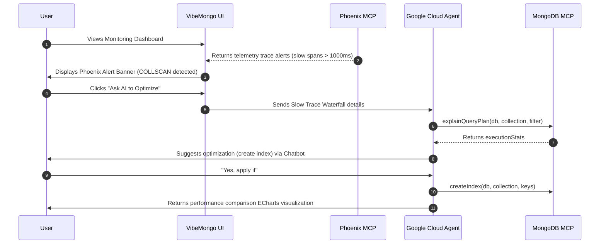

# 🛡️ DB-Guardian (AI Database SRE & Auto-Indexer)

VibeMongo Admin features an automated **Database SRE & Auto-Indexer** module named **DB-Guardian**. It bridges real-time database query telemetry from **Arize Phoenix Cloud & MCP** with automated database optimization capabilities from **Google Cloud Agent (Gemini)** and **MongoDB MCP**.

## 🧠 SRE Workflow

## ⚖️ AI Judge Evaluate (LLM-as-a-Judge)

One of the standout features of DB-Guardian is the ability to audit any executed database command using Google Gemini acting as a strict **AI Judge**. 

Since the `@arizeai/phoenix-mcp` package lacks a native `run-evaluation` tool that accepts custom prompt injection directly, we built a robust workaround directly into VibeMongo:

1. **User clicks "AI Judge Evaluate"** on a trace span in the UI.
2. The UI extracts the exact `input.value` (the raw MongoDB command/pipeline) and `output.value` (the database response) from the trace.
3. The UI automatically opens the **Agent Chat Sidebar** and feeds a specialized prompt into the conversational context.
4. **Google Cloud Agent (Gemini)** executes the prompt, analyzing the payload to determine if it is `SAFE`, `OPTIMAL`, or `SUBOPTIMAL`.
5. The Agent replies in the user's native language (English or Vietnamese, contextually mapped from the Vue UI), explaining step-by-step what the command did, what the result means, and why it received that safety score.

## 🛠️ The Observability Layer

DB-Guardian uses real telemetry data pushed via OpenTelemetry (`@arizeai/phoenix-otel`) to the Arize Phoenix Collector.

### 1. Traces (`get-trace` via MCP)
VibeMongo queries the Phoenix MCP server dynamically to pull trace waterfalls for the active MongoDB connection.

### 2. Query Plan Diagnostics
The AI Agent can autonomously run MongoDB `.explain('executionStats')` on target slow queries using the MongoDB MCP server to determine the access method (COLLSCAN vs IXSCAN) and examine execution metrics.

## 📊 Live ECharts Performance Comparison
Once the index is successfully created, the Agent responds to the client with a specialized `[CHART]` block comparing query execution times *before* (COLLSCAN) vs *after* (IXSCAN) the index was applied.

The Vue 3 UI catches this structured block and renders a dynamic bar chart comparing the two latency levels right in the chat window!
