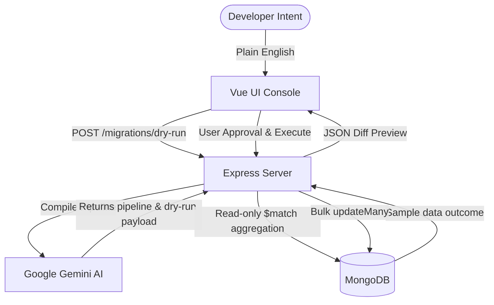
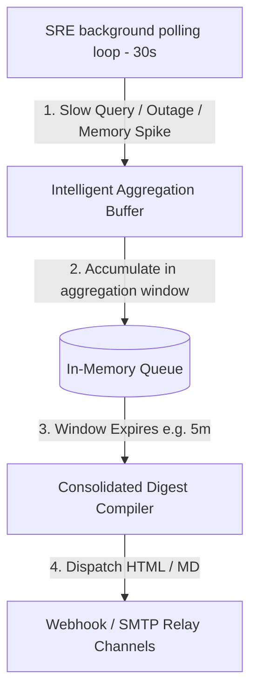

# 🚀 Premium AI SRE & Database Administration Upgrades

VibeMongo Admin features **five groundbreaking premium upgrades** that transform the platform into a state-of-the-art, AI-driven MongoDB SRE and management dashboard. These upgrades bridge real-time database query telemetry from **Arize Phoenix**, automated database optimization capabilities from **Google Cloud Agent (Gemini)**, and native operations via **MongoDB MCP**.

---

## 📚 Table of Contents
1. [🔄 AI Schema Migrator & Document Transformer](#1--ai-schema-migrator--document-transformer)
2. [🧹 AI Index Sanitizer & Cleanup](#2--ai-index-sanitizer--cleanup)
3. [🗺️ Interactive AI Schema & Relation Mapper (ERD)](#3--interactive-ai-schema--relation-mapper-erd)
4. [🧪 AI Smart Mock Data Generator](#4--ai-smart-mock-data-generator)
5. [🛡️ Auto-Pilot Alerting & Webhook Notifications](#5--auto-pilot-alerting--webhook-notifications)
6. [🌐 Multi-Language Parity & Localization](#6--multi-language-parity--localization)

---

## 🔄 1. AI Schema Migrator & Document Transformer

### 💡 Concept
Refactoring document schemas as applications scale is often risky and complex. VibeMongo's **AI Schema Migrator** enables developers to describe their structural update intents in plain English (e.g., *"Rename 'price' to 'amount' and convert the value from string to double"*), compiles them into native MongoDB aggregation pipelines, and executes them with a strict zero-risk safety protocol.

### 🛠️ Technical Architecture

- **Safety Dry-Run Engine:** The server pulls a single representative document from the collection, executes a read-only MongoDB aggregation `$match` pipeline locally to compute the outcome, and compares the original document side-by-side with the dry-run transformed document.
- **Bulk Execution:** Upon user approval, the compiled aggregation pipeline is applied atomically using MongoDB's native `updateMany({}, pipeline)` protocol.

### 🎨 Visual UI/UX & Localization
- **File Location:** [CollectionTransformer.vue](file:///d:/Workspace/Gits/CamHub/vibe-mongo-admin/client/src/components/collection/CollectionTransformer.vue)
- **Features:** Side-by-side JSON editor view showing original vs. predicted structure, expandable compiled aggregation code blocks, quick-intent template selectors, and multi-step confirmation modals.
- **Key Translation Keys:** `Quick Intent Templates:`, `Run Safe Dry-Run Preview`, `AI SRE Safe Migration Analysis`, `Compiled Raw MongoDB Update Aggregation Pipeline`, `Ready for Bulk Execution?`, `Execute Schema Migration`.

---

## 🧹 2. AI Index Sanitizer & Cleanup

### 💡 Concept
Redundant, overlapping, or unused indexes slow down database writes (`insert`, `update`, `delete`) and waste valuable memory (RAM). The **AI Index Sanitizer** scans your database index design and telemetry statistics to locate redundant structures and securely drop them.

### 🛠️ Technical Architecture
- **Overlap & Redundancy Scanner:** Checks compound indexes for overlapping fields. For example, if a compound index on `{ user_id: 1, created_at: -1 }` exists, a single index on `{ user_id: 1 }` is redundant because MongoDB's query optimizer can use the prefix of the compound index.
- **Telemetry Matcher:** Leverages historical trace data from the **Arize Phoenix Observability** telemetry span list to identify index misses or underutilized indexes.
- **Remediation:** Provides a safe health score card and dynamic clean-up triggers using MongoDB's `dropIndex(name)` interface.

### 🎨 Visual UI/UX & Localization
- **File Location:** [CollectionIndexes.vue](file:///d:/Workspace/Gits/CamHub/vibe-mongo-admin/client/src/components/collection/CollectionIndexes.vue)
- **Features:** Health Circular Gauge with dynamic color alerts, individual health diagnostic badges (`HEALTHY`, `REDUNDANT`, `UNUSED`), and safety breakdown popups detailing query optimization benefits before dropping.
- **Key Translation Keys:** `AI Overlap & Redundant Index Scan`, `Index Health & Optimization Score`, `AI SRE Performance Diagnostic`, `Index Health Diagnostic Details`, `AI Safe Cleanup`, `Are you sure you want to drop index {name}?`.

---

## 🗺️ 3. Interactive AI Schema & Relation Mapper (ERD)

### 💡 Concept
MongoDB databases are document-oriented and schema-less, making it difficult for teams to map out relational references. The **Schema ERD Mapper** uses Google Gemini to automatically infer active references (such as DBRefs, object identifiers, and naming conventions like `userId` referencing `_id` in `users`) and plots an interactive, zoomable ERD relationship canvas.

### 🛠️ Technical Architecture
1. **轻量 Schema Analysis:** Sample 5-10 documents per collection to extract structural schemas and field lists.
2. **Inference Processor:** Submits collection schemas to Gemini to identify cross-collection relational keys and cardinalities.
3. **Canvas Compiler:** Compiles relationships into high-fidelity `Mermaid.js` source code.
4. **Visual Canvas:** Renders interactive, responsive diagrams in Vue using `mermaid.js`, supporting custom styles, node selection, and zoom/pan functionality.

### 🎨 Visual UI/UX & Localization
- **File Location:** [CollectionErd.vue](file:///d:/Workspace/Gits/CamHub/vibe-mongo-admin/client/src/components/collection/CollectionErd.vue)
- **Features:** Visual SVG ERD canvas with custom node connectors, relational explanation panels, and copyable raw Mermaid scripts.
- **Key Translation Keys:** `Interactive AI Relationship Schema Map (ERD)`, `Generate Schema ERD Map`, `AI SRE Relationship Discovery Explanation`, `Interactive ERD Graph Canvas`.

---

## 🧪 4. AI Smart Mock Data Generator

### 💡 Concept
Generating realistic, high-fidelity mock data for staging and developer sandboxes is a major pipeline requirement. The **AI Smart Mock Data Generator** reviews active collection schemas and generates coherent, mathematically aligned, and localized test records rather than using standard generic placeholders.

### 🛠️ Technical Architecture
- **Semantic Data Compiler:** Reads the actual collection schema (field keys and BSON data types) and user-supplied custom constraints.
- **Generation:** Queries Gemini to return custom localized BSON-compliant arrays adhering to specified languages (e.g. English, Tiếng Việt, German, Spanish).
- **Insertion:** Inserts documents directly into the collection in batches using `insertMany`.

### 🎨 Visual UI/UX & Localization
- **File Location:** Triggered via the **Insert Document** sub-ribbon or Collection views.
- **Features:** Locale and language dropdowns, document count inputs, custom plain-English constraints box, and real-time progress indicators.
- **Key Translation Keys:** `AI Smart Mock Data Generator`, `Number of Documents`, `Data Locale / Language`, `Custom Constraints (Optional)`, `Generate Data`.

---

## 🛡️ 5. Auto-Pilot Alerting, SMTP Relay & Spam Prevention

### 💡 Concept
Shift from a reactive dashboard to a proactive, production-grade automated SRE monitoring suite. VibeMongo's background worker monitors database connection health, resource usage, and query performance traces. It proactively delivers rich, high-fidelity diagnostic reports straight to Webhook endpoints (Discord/Slack) and customized SMTP mail server configurations, automatically batching concurrent events to eliminate alert fatigue.

### 🛠️ Technical Architecture

- **Periodic Monitor Scheduler:** Express SRE worker polling local Node/OS telemetry and Arize Phoenix trace collections every 30 seconds.
- **Unified Alert Delivery Channels**:
  1. **Webhook Targets**: Pushes JSON-formatted markdown alert payloads to target URLs.
  2. **SMTP Relay Channels**: Injects `nodemailer` to dispatch professionally styled HTML email reports with live database performance metrics.
- **Intelligent Spam Prevention (Smart Alert Aggregation)**: Instead of flooding target inboxes with hundreds of sequential alerts (e.g. during a database overload), the SRE engine queues incoming incidents in an in-memory buffer. Once the aggregation window expires (customizable via 5m, 15m, 30m, or 1h), a beautifully compiled consolidated digest of all incidents is formatted and delivered.

### 🎨 Visual UI/UX & Localization
- **File Location:** [WebhookIntegrations.vue](file:///d:/Workspace/Gits/CamHub\vibe-mongo-admin/client/src/components/monitoring/WebhookIntegrations.vue)
- **Features**:
  - **Dynamic `el-switch` Controllers**: Replaced basic static text badges with color-coded Element Plus switches to toggle active monitoring channels in real-time.
  - **Custom SMTP Credential Panel**: Collapse/expand form containing server details, SSL/TLS switches, usernames, passwords, and custom sender aliases.
  - **Smart Aggregation Configuration**: Sleek controls to toggle the Spam Prevention engine and select aggregation windows.
  - **Terminal Activity Log**: Renders dynamic micro-animations and colored text console updates of outbound dispatches.
- **Key Translation Keys:** `Webhook Target URL`, `Email Target Address`, `SMTP Mail Server Configuration`, `SSL/TLS Secure`, `Notification Spam Prevention (Smart Aggregation)`, `Aggregation Time Window`, `Event Subscriptions (Alert Triggers)`, `COLLSCAN & Slow Query Spikes`, `Container Resource Spikes`, `Database Connection Failures`, `Test Alert Channels`, `Save Settings`.

---

## 🌐 6. Multi-Language Parity & Localization

Every single SRE and Premium component is 100% localized across all 8 supported system languages, ensuring complete global usability:

| Locale Code | Language | File Path |
|-------------|----------|-----------|
| `en` | English | [en.js](file:///d:/Workspace/Gits/CamHub/vibe-mongo-admin/client/src/locales/en.js) |
| `vi` | Tiếng Việt | [vi.js](file:///d:/Workspace/Gits/CamHub/vibe-mongo-admin/client/src/locales/vi.js) |
| `de` | Deutsch | [de.js](file:///d:/Workspace/Gits/CamHub/vibe-mongo-admin/client/src/locales/de.js) |
| `es` | Español | [es.js](file:///d:/Workspace/Gits/CamHub/vibe-mongo-admin/client/src/locales/es.js) |
| `it` | Italiano | [it.js](file:///d:/Workspace/Gits/CamHub/vibe-mongo-admin/client/src/locales/it.js) |
| `ru` | Русский | [ru.js](file:///d:/Workspace/Gits/CamHub/vibe-mongo-admin/client/src/locales/ru.js) |
| `zh-cn` | 简体中文 | [zh-cn.js](file:///d:/Workspace/Gits/CamHub/vibe-mongo-admin/client/src/locales/zh-cn.js) |
| `fa` | فارسی | [fa.js](file:///d:/Workspace/Gits/CamHub/vibe-mongo-admin/client/src/locales/fa.js) |
