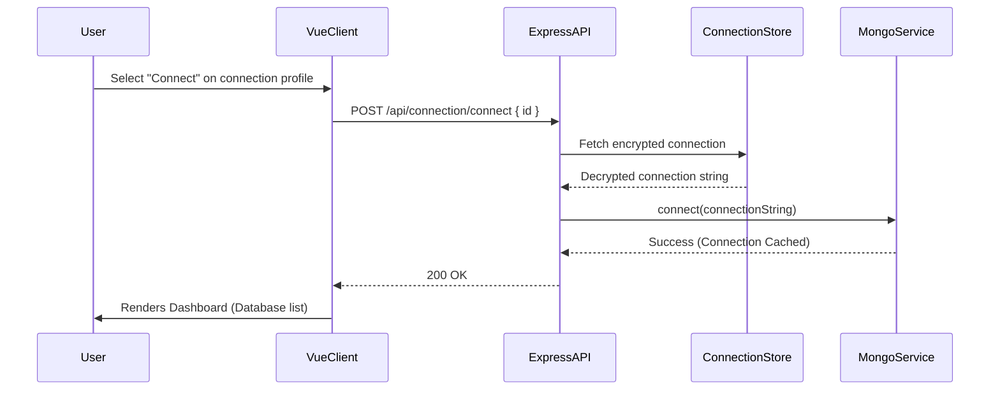
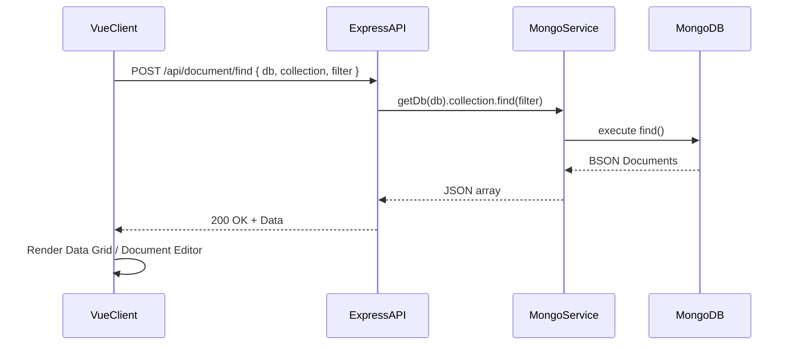
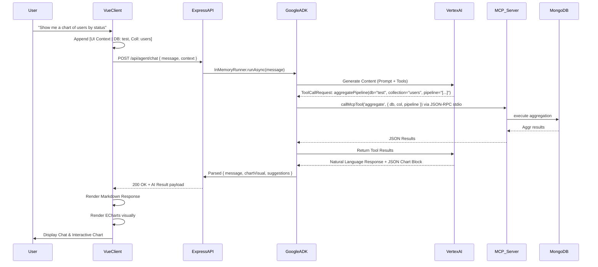
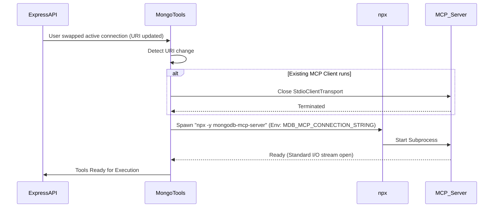

# Workflow Diagrams

This document details the sequence of operations between the VibeMongo Vue Client, Express Backend, Google ADK Agent, MongoDB MCP Server, and the target MongoDB database.

## 1. Database Connection Initialization

## 2. Standard Document Query

## 3. AI Agent Tool Execution Workflow

This is the core workflow demonstrating how a natural language prompt is translated into a MongoDB execution via the Model Context Protocol (MCP).

## 4. MCP Server Subprocess Lifecycle

The backend manages the lifecycle of the `mongodb-mcp-server` to ensure the correct connection context is used by the Agent.

