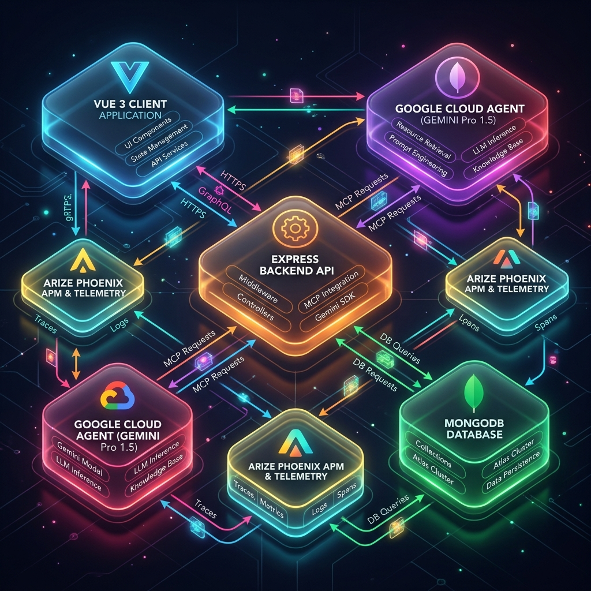
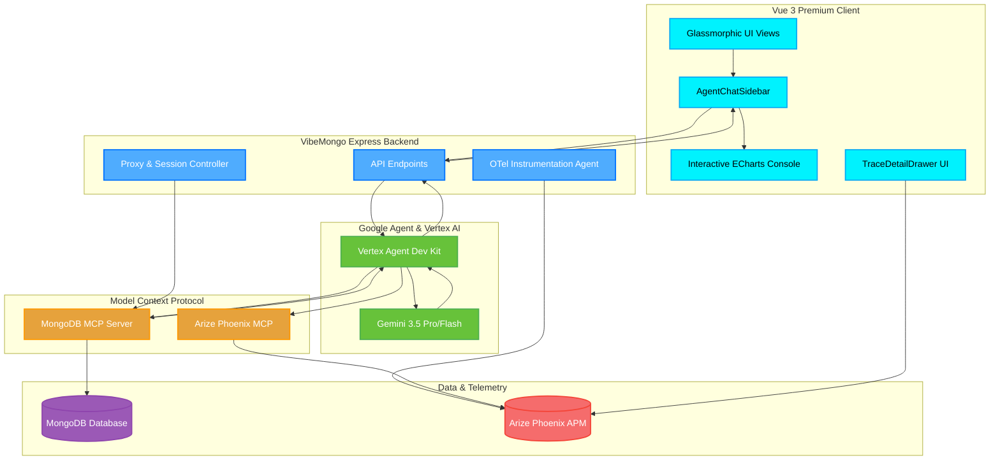

# VibeMongo Tri-Partner Architecture Diagram

---

## 📐 System Architecture Diagram

---

## 🔄 Sequence of Key Workflows

### 1. The Conversational DB Query Workflow
1. The **User** enters a prompt in the `AgentChatSidebar` (e.g., *"Show me user registration count by month"*).
2. The **VibeMongo Backend** forwards the prompt to the **Google ADK Agent**.
3. **Gemini** analyzes the schema via tool calls routed through the **MongoDB MCP Server**.
4. The **MongoDB MCP Server** translates and runs the query against the target **MongoDB**.
5. The result is returned to **Gemini**, which wraps the data into a structured JSON block (e.g., charts, collection navigation buttons).
6. The **Vue 3 Client** parses the structured tags and instantly renders interactive **ECharts** graphs in the chat conversation list.

### 2. Performance Diagnostics & DB-Guardian SRE Loop
1. The **OTel Instrumentation Agent** exports performance telemetry spans of all DB queries and LLM invocations to **Arize Phoenix**.
2. **Arize Phoenix** triggers alert badges on the **VibeMongo Client** if query speeds drop below threshold limits.
3. The user clicks *"Evaluate recent slow trace with AI Judge"*.
4. **Google Agent SDK** retrieves the slow span telemetry via **Phoenix MCP**.
5. **Gemini** performs automatic optimization analysis and details a step-by-step resolution roadmap (e.g. suggesting custom indexes) to the user.
